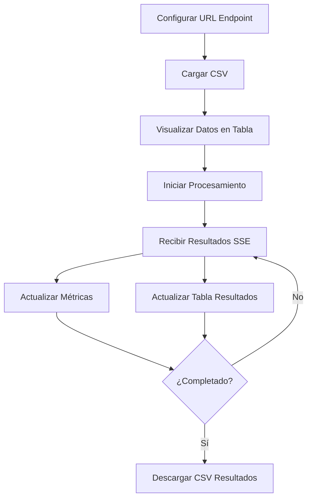

# Product Requirements Document (PRD)

## Web SPA para Evaluación Automatizada de Textos Educativos

### 1. Resumen Ejecutivo

**Proyecto**: Aplicación Web SPA para consumo de API de Evaluación de Textos  
**Versión**: 1.0 - Prueba de Concepto  
**Fecha**: Diciembre 2024  
**Stack Tecnológico**: React + Vite + Tailwind CSS v3 + shadcn/ui  
**Propósito**: Interfaz para procesar CSVs masivos de textos educativos y visualizar evaluaciones automáticas con métricas de fiabilidad

### 2. Objetivos del Proyecto

#### 2.1 Objetivo Principal

Crear una interfaz web elegante y simple que permita cargar CSVs con respuestas de estudiantes, procesarlas mediante la API de evaluación, y analizar la fiabilidad del modelo comparando con evaluaciones humanas existentes.

#### 2.2 Objetivos Específicos

- Cargar y visualizar CSVs de hasta 3000+ filas eficientemente
- Procesar textos mediante SSE con feedback en tiempo real
- Calcular métricas de fiabilidad (ICC) dinámicamente
- Exportar resultados enriquecidos con evaluaciones del modelo

### 3. Especificaciones Funcionales

#### 3.1 Flujo Principal de Usuario



#### 3.2 Funcionalidades Core

| Funcionalidad          | Descripción                             | Prioridad |
| ---------------------- | --------------------------------------- | --------- |
| Configuración Endpoint | Input persistente en localStorage       | Alta      |
| Carga CSV              | Drag & drop o selector de archivo       | Alta      |
| Tabla Virtual          | Renderizado eficiente de miles de filas | Alta      |
| Procesamiento SSE      | Streaming de resultados en tiempo real  | Alta      |
| Métricas Dinámicas     | ICC(3,1) y desviación vs mediana        | Alta      |
| Barra de Progreso      | Visual del avance y tiempo restante     | Alta      |
| Exportar Resultados    | Descarga CSV con evaluaciones           | Alta      |
| Diseño Responsive      | Adaptable a diferentes pantallas        | Media     |

### 4. Arquitectura de la Aplicación

```
┌─────────────────────────────────────┐
│         App.jsx (Main)              │
│  ┌─────────────────────────────┐    │
│  │   ConfigurationSection      │    │
│  │   - Endpoint URL           │    │
│  │   - CSV Separator          │    │
│  └─────────────────────────────┘    │
│                                     │
│  ┌─────────────────────────────┐    │
│  │   FileUploadSection         │    │
│  │   - CSV Parser             │    │
│  │   - Validation             │    │
│  └─────────────────────────────┘    │
│                                     │
│  ┌─────────────────────────────┐    │
│  │   DataVisualization         │    │
│  │   ┌──────────┬──────────┐   │    │
│  │   │InputTable│ResultTable│   │    │
│  │   │(Virtual) │(Virtual)  │   │    │
│  │   └──────────┴──────────┘   │    │
│  └─────────────────────────────┘    │
│                                     │
│  ┌─────────────────────────────┐    │
│  │   ProcessingSection         │    │
│  │   - SSE Handler            │    │
│  │   - Progress Bar           │    │
│  │   - Time Estimation        │    │
│  └─────────────────────────────┘    │
│                                     │
│  ┌─────────────────────────────┐    │
│  │   MetricsPanel              │    │
│  │   - ICC Calculator         │    │
│  │   - Deviation Stats        │    │
│  │   - Live Updates           │    │
│  └─────────────────────────────┘    │
└─────────────────────────────────────┘
```

### 5. Especificación de Componentes

#### 5.1 ConfigurationSection

```typescript
interface ConfigProps {
  endpointUrl: string; // Persistido en localStorage
  csvSeparator: string; // Default: ';'
  onConfigChange: (config) => void;
}
```

**Características**:

- Input con valor inicial desde localStorage
- Botón "Guardar" para persistir cambios
- Indicador visual de conexión válida

#### 5.2 FileUploadSection

```typescript
interface FileUploadProps {
  separator: string;
  onDataLoaded: (data: ParsedData[]) => void;
}

interface ParsedData {
  id_participante: string;
  respuesta: string;
  curso: string;
  pregunta: string;
  evaluacion_1: number;
  evaluacion_2?: number;
  evaluacion_3?: number;
}
```

**Características**:

- Drag & drop área
- Parsing con Papaparse
- Validación de columnas requeridas
- Preview de primeras filas

#### 5.3 VirtualTable (Input & Results)

```typescript
interface VirtualTableProps {
  data: any[];
  columns: ColumnDef[];
  height: number;
  rowHeight: number;
}
```

**Librerías sugeridas**:

- `@tanstack/react-virtual` para virtualización
- `@tanstack/react-table` para funcionalidad de tabla

#### 5.4 ProcessingController

```typescript
interface ProcessingState {
  jobId: string | null;
  status: "idle" | "processing" | "completed" | "error";
  progress: {
    completed: number;
    total: number;
    percentage: number;
    estimatedTimeRemaining: number;
  };
  results: EvaluationResult[];
}
```

**SSE Handler**:

```javascript
const eventSource = new EventSource(`${endpoint}/stream/${jobId}`);

eventSource.addEventListener("batch_complete", (event) => {
  const data = JSON.parse(event.data);
  updateResults(data.results);
  updateMetrics(data.results);
  updateProgress(data.progress);
});
```

#### 5.5 MetricsPanel

```typescript
interface Metrics {
  icc: number; // ICC(3,1)
  iccInterpretation: string; // "Poor" | "Fair" | "Good" | "Excellent"
  meanDeviation: number; // Desviación promedio modelo vs mediana
  stdDeviation: number; // Desviación estándar
  processedCount: number; // Textos procesados
  reliabilityStatus: "reliable" | "unreliable"; // ICC > 0.8
}
```

**Cálculo ICC(3,1)**:

```javascript
function calculateICC31(modelScores, humanMedians) {
  // ICC(3,1): Single rater, consistency
  // Implementación usando varianzas
  const n = modelScores.length;
  const pairs = modelScores.map((m, i) => [m, humanMedians[i]]);

  // Cálculo de componentes de varianza
  const MSR = calculateMSR(pairs); // Mean Square Rows
  const MSE = calculateMSE(pairs); // Mean Square Error

  const icc = (MSR - MSE) / (MSR + MSE);
  return icc;
}
```

### 6. Estructura del Proyecto

```
text-evaluation-web/
├── package.json
├── vite.config.js
├── tailwind.config.js
├── postcss.config.js
├── index.html
├── .env.example
├── README.md
├── public/
│   └── favicon.ico
├── src/
│   ├── main.jsx
│   ├── App.jsx
│   ├── index.css
│   ├── components/
│   │   ├── ui/               # shadcn/ui components
│   │   │   ├── button.jsx
│   │   │   ├── input.jsx
│   │   │   ├── card.jsx
│   │   │   ├── progress.jsx
│   │   │   ├── alert.jsx
│   │   │   └── table.jsx
│   │   ├── ConfigurationSection.jsx
│   │   ├── FileUploadSection.jsx
│   │   ├── VirtualTable.jsx
│   │   ├── ProcessingController.jsx
│   │   ├── MetricsPanel.jsx
│   │   └── ResultsExporter.jsx
│   ├── hooks/
│   │   ├── useLocalStorage.js
│   │   ├── useSSE.js
│   │   └── useVirtualTable.js
│   ├── services/
│   │   ├── api.js           # API client
│   │   ├── csvParser.js     # CSV handling
│   │   └── metrics.js       # ICC calculations
│   ├── utils/
│   │   ├── formatters.js
│   │   └── validators.js
│   └── lib/
│       └── utils.js         # shadcn/ui utilities
```

### 7. Diseño de Interfaz

#### 7.1 Layout Principal

```
┌──────────────────────────────────────────────┐
│  📊 Evaluador de Textos Educativos          │
├──────────────────────────────────────────────┤
│  ┌──────────────────────────────────────┐    │
│  │ ⚙️ Configuración                     │    │
│  │  Endpoint: [_______________] [Save]  │    │
│  │  Separador CSV: [;] (,) (|)         │    │
│  └──────────────────────────────────────┘    │
│                                              │
│  ┌──────────────────────────────────────┐    │
│  │ 📁 Cargar Archivo CSV                │    │
│  │  ┌────────────────────────────┐      │    │
│  │  │   Arrastra tu archivo aquí  │      │    │
│  │  │   o haz clic para buscar    │      │    │
│  │  └────────────────────────────┘      │    │
│  └──────────────────────────────────────┘    │
│                                              │
│  ┌──────────────────────────────────────┐    │
│  │ 📊 Métricas de Fiabilidad           │    │
│  │  ICC(3,1): 0.85 ✅ (Excelente)      │    │
│  │  Desviación media: 0.42             │    │
│  │  Procesados: 150/1500               │    │
│  └──────────────────────────────────────┘    │
│                                              │
│  ┌──────────────────────────────────────┐    │
│  │ Progreso: ████████░░░░░░ 40%        │    │
│  │ Tiempo restante: ~3:45 min           │    │
│  └──────────────────────────────────────┘    │
│                                              │
│  [Tabs: Datos Originales | Resultados]       │
│  ┌──────────────────────────────────────┐    │
│  │ [Virtual Table Area - 400px height]  │    │
│  └──────────────────────────────────────┘    │
│                                              │
│  [Procesar Textos] [Descargar Resultados]    │
└──────────────────────────────────────────────┘
```

#### 7.2 Paleta de Colores (Tailwind)

```css
/* Tema claro y profesional */
--primary: blue-600 --secondary: slate-600 --success: green-600
  --warning: amber-600 --danger: red-600 --background: white --surface: gray-50
  --text: gray-900 --border: gray-200;
```

### 8. Flujo de Datos

```javascript
// 1. Mapeo de columnas CSV → API
const mapToAPIFormat = (csvRow) => ({
  id_alumno: csvRow.id_participante,
  curso: csvRow.curso,
  consigna: csvRow.pregunta,
  respuesta: csvRow.respuesta,
});

// 2. Cálculo de mediana por fila
const calculateMedian = (row) => {
  const scores = [row.evaluacion_1, row.evaluacion_2, row.evaluacion_3].filter(
    (v) => v !== null && v !== undefined && v !== "",
  );

  scores.sort((a, b) => a - b);
  const mid = Math.floor(scores.length / 2);

  return scores.length % 2 !== 0
    ? scores[mid]
    : (scores[mid - 1] + scores[mid]) / 2;
};

// 3. Estructura de resultado enriquecido
const enrichedResult = {
  ...originalRow,
  evaluacion_modelo: apiResult.nota,
  mediana_humana: calculateMedian(originalRow),
  desviacion: Math.abs(apiResult.nota - calculateMedian(originalRow)),
};
```

### 9. Gestión de Estado (React)

```javascript
// Estado principal de la aplicación
const [appState, setAppState] = useState({
  config: {
    endpoint: localStorage.getItem("endpoint") || "",
    separator: localStorage.getItem("separator") || ";",
  },
  data: {
    original: [], // Datos CSV cargados
    results: [], // Resultados del modelo
    merged: [], // Datos combinados
  },
  processing: {
    isActive: false,
    jobId: null,
    progress: 0,
    timeRemaining: null,
  },
  metrics: {
    icc: null,
    meanDeviation: null,
    reliabilityMet: false,
  },
});
```

### 10. Manejo de Errores

```javascript
// Wrapper para manejo global de errores
const handleError = (error, context) => {
  console.error(`Error in ${context}:`, error);

  // Mostrar alert simple con error raw
  alert(`Error: ${error.message || error}`);

  // Reset estado si es necesario
  if (context === "processing") {
    setProcessingState((prev) => ({
      ...prev,
      isActive: false,
      status: "error",
    }));
  }
};

// Try-catch en operaciones críticas
try {
  const response = await fetch(`${endpoint}/evaluate`, options);
  if (!response.ok) throw new Error(response.statusText);
} catch (error) {
  handleError(error, "api-call");
}
```

### 11. Implementación de Componentes Clave

#### 11.1 Hook useSSE

```javascript
const useSSE = (url, onMessage, onError, onComplete) => {
  useEffect(() => {
    if (!url) return;

    const eventSource = new EventSource(url);

    eventSource.addEventListener("batch_complete", (e) => {
      const data = JSON.parse(e.data);
      onMessage(data);
    });

    eventSource.addEventListener("complete", (e) => {
      const data = JSON.parse(e.data);
      onComplete(data);
      eventSource.close();
    });

    eventSource.onerror = (error) => {
      onError(error);
      eventSource.close();
    };

    return () => eventSource.close();
  }, [url]);
};
```

#### 11.2 MetricsPanel Component

```jsx
const MetricsPanel = ({ results, originalData }) => {
  const metrics = useMemo(() => {
    if (results.length === 0) return null;

    const modelScores = results.map((r) => r.nota);
    const humanMedians = results.map((r) => {
      const original = originalData.find(
        (o) => o.id_participante === r.id_alumno,
      );
      return calculateMedian(original);
    });

    const icc = calculateICC31(modelScores, humanMedians);
    const deviations = modelScores.map((m, i) => Math.abs(m - humanMedians[i]));

    return {
      icc: icc.toFixed(3),
      iccStatus: getICCInterpretation(icc),
      meanDeviation: mean(deviations).toFixed(2),
      stdDeviation: std(deviations).toFixed(2),
      isReliable: icc > 0.8,
    };
  }, [results, originalData]);

  if (!metrics) return null;

  return (
    <Card className="p-4">
      <CardHeader>
        <CardTitle>📊 Métricas de Fiabilidad</CardTitle>
      </CardHeader>
      <CardContent>
        <div className="space-y-2">
          <div className="flex justify-between">
            <span>ICC(3,1):</span>
            <Badge variant={metrics.isReliable ? "success" : "warning"}>
              {metrics.icc} - {metrics.iccStatus}
            </Badge>
          </div>
          <div className="flex justify-between">
            <span>Desviación media:</span>
            <span>{metrics.meanDeviation}</span>
          </div>
          <div className="flex justify-between">
            <span>Procesados:</span>
            <span>
              {results.length}/{originalData.length}
            </span>
          </div>
        </div>
      </CardContent>
    </Card>
  );
};
```

### 12. Scripts de Instalación

#### package.json

```json
{
  "name": "text-evaluation-web",
  "version": "1.0.0",
  "type": "module",
  "scripts": {
    "dev": "vite",
    "build": "vite build",
    "preview": "vite preview"
  },
  "dependencies": {
    "react": "^18.2.0",
    "react-dom": "^18.2.0",
    "papaparse": "^5.4.1",
    "@tanstack/react-virtual": "^3.0.0",
    "@tanstack/react-table": "^8.11.0",
    "clsx": "^2.0.0",
    "tailwind-merge": "^2.2.0",
    "lucide-react": "^0.300.0",
    "class-variance-authority": "^0.7.0",
    "@radix-ui/react-alert-dialog": "^1.0.5",
    "@radix-ui/react-slot": "^1.0.2",
    "@radix-ui/react-progress": "^1.0.3"
  },
  "devDependencies": {
    "@types/react": "^18.2.0",
    "@types/react-dom": "^18.2.0",
    "@vitejs/plugin-react": "^4.2.0",
    "autoprefixer": "^10.4.16",
    "postcss": "^8.4.32",
    "tailwindcss": "^3.4.0",
    "vite": "^5.0.0"
  }
}
```

### 13. Configuración de Vite

```javascript
// vite.config.js
import { defineConfig } from "vite";
import react from "@vitejs/plugin-react";
import path from "path";

export default defineConfig({
  plugins: [react()],
  resolve: {
    alias: {
      "@": path.resolve(__dirname, "./src"),
    },
  },
  server: {
    port: 3000,
    open: true,
  },
});
```

### 14. Instrucciones de Despliegue

```bash
# Instalación inicial
npm create vite@latest text-evaluation-web -- --template react
cd text-evaluation-web
npm install

# Instalar dependencias
npm install papaparse @tanstack/react-virtual @tanstack/react-table
npm install -D tailwindcss postcss autoprefixer
npx tailwindcss init -p

# Configurar shadcn/ui
npx shadcn-ui@latest init
npx shadcn-ui@latest add button card input progress alert badge tabs

# Desarrollo
npm run dev

# Build para producción
npm run build
npm run preview
```

### 15. Consideraciones de Performance

#### 15.1 Optimizaciones

- **Virtualización**: Tablas con react-virtual para manejar 3000+ filas
- **Memoización**: useMemo para cálculos pesados (ICC, medianas)
- **Debouncing**: En actualizaciones de métricas (cada 500ms máximo)
- **Lazy loading**: Componentes pesados solo cuando son necesarios

#### 15.2 Límites

- **Tamaño máximo CSV**: 50MB (configurable)
- **Filas máximas**: 3000 (límite suave, puede procesar más)
- **Batch size SSE**: 10 items (definido por la API)
- **Timeout conexión**: 30 segundos inicial, infinito durante streaming

### 16. Roadmap Futuro (v2.0)

- [ ] Soporte para múltiples evaluaciones simultáneas
- [ ] Historial de evaluaciones anteriores
- [ ] Gráficos de distribución de notas
- [ ] Comparación entre diferentes modelos
- [ ] Filtros y búsqueda en tablas
- [ ] Exportación a Excel además de CSV
- [ ] Dark mode
- [ ] PWA para uso offline parcial

### 17. Métricas de Éxito del PoC

| Métrica                        | Objetivo                                    | Crítico               |
| ------------------------------ | ------------------------------------------- | --------------------- |
| Tiempo carga CSV 3000 filas    | < 2 seg                                     | < 5 seg               |
| Renderizado tabla virtual      | 60 FPS                                      | 30 FPS                |
| Consumo memoria con 3000 filas | < 200MB                                     | < 500MB               |
| Actualización métricas         | < 100ms                                     | < 500ms               |
| Tasa de error en SSE           | < 1%                                        | < 5%                  |
| Compatibilidad navegadores     | Chrome, Firefox, Safari últimas 2 versiones | Chrome última versión |

### 18. Notas de Implementación

#### 18.1 Fórmula ICC(3,1) Simplificada

```javascript
// ICC(3,1) - Single rater, consistency
// Basado en el modelo de efectos mixtos de dos vías
function calculateICC31(scores1, scores2) {
  const n = scores1.length;

  // Calcular medias
  const mean1 = scores1.reduce((a, b) => a + b) / n;
  const mean2 = scores2.reduce((a, b) => a + b) / n;
  const grandMean = (mean1 + mean2) / 2;

  // Calcular sumas de cuadrados
  let SST = 0,
    SSW = 0,
    SSB = 0;

  for (let i = 0; i < n; i++) {
    const rowMean = (scores1[i] + scores2[i]) / 2;
    SSB += 2 * Math.pow(rowMean - grandMean, 2);
    SSW += Math.pow(scores1[i] - rowMean, 2);
    SSW += Math.pow(scores2[i] - rowMean, 2);
    SST += Math.pow(scores1[i] - grandMean, 2);
    SST += Math.pow(scores2[i] - grandMean, 2);
  }

  const MSB = SSB / (n - 1);
  const MSW = SSW / n;

  const icc = (MSB - MSW) / (MSB + MSW);
  return Math.max(0, Math.min(1, icc)); // Clamp between 0 and 1
}
```

#### 18.2 Interpretación ICC

```javascript
function getICCInterpretation(icc) {
  if (icc < 0.5) return "Pobre";
  if (icc < 0.75) return "Moderado";
  if (icc < 0.9) return "Bueno";
  return "Excelente";
}
```

---

**Aprobación**:  
Firma: ******\_\_\_\_******  
Fecha: ******\_\_\_\_******  
Versión: 1.0 - PoC
